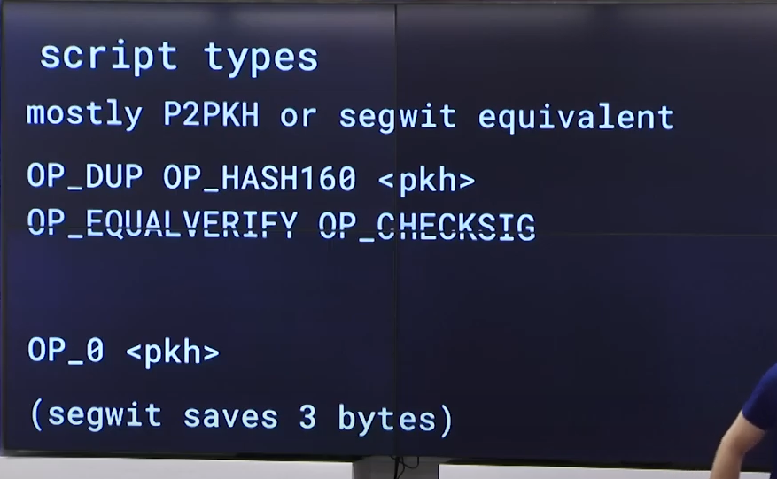
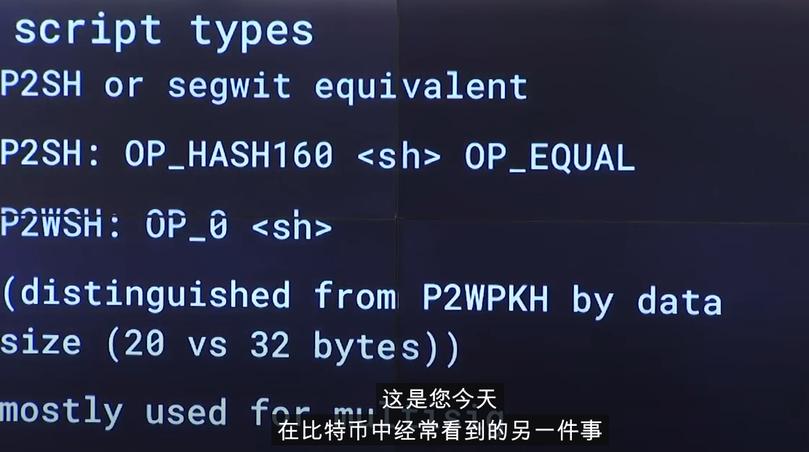
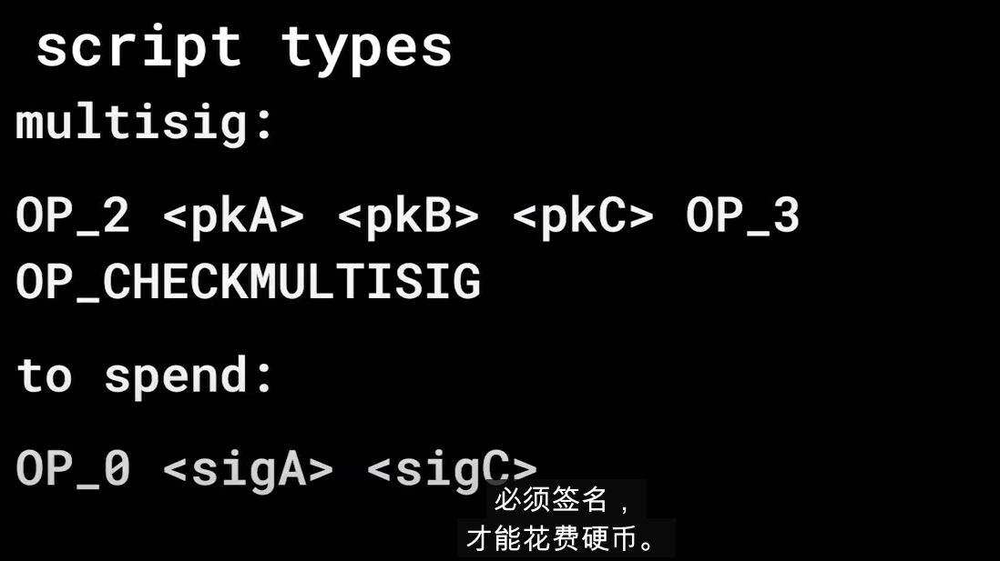
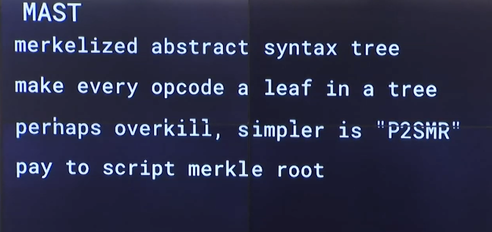

# BTC 地址格式研究

- 传统地址(legacy address)
p2pkh 地址支付公钥哈希地址
15f12gEh2DFcHyhSyu7v3Bji5T3CJa9Smn

- 支付脚本哈希 pay-to-script-hash
P2SH 地址
35PBEaofpUeH8VnnNSorM1QZsadrZoQp4N

- 隔离见证地址: segwit bech32 地址
bc1q42lja79elem0anu8q8s3h2n687re9jax556pcc

- taproot 地址
bc1pmzfrwwndsqmk5yh69yjr5lfgfg4ev8c0tsc06e

## oridinal
[ord](https://github.com/ordinals/ord)
[brc20](https://domo-2.gitbook.io/brc-20-experiment/examples)

## brc20

## MAST, TAPROOT,GRAFTROOT







## psbt

 ### 部分签名的比特币交易协议

- 安全
- 灵活性
- 互操作性
- 钱包安全(离线签名)
- 批量交易
- 无需信任的原子交换

### bip174 研读
- 格式
```
 <psbt> := <magic> <global-map> <input-map>* <output-map>*
 <magic> := 0x70 0x73 0x62 0x74 0xFF
 <global-map> := <keypair>* 0x00
 <input-map> := <keypair>* 0x00
 <output-map> := <keypair>* 0x00
 <keypair> := <key> <value>
 <key> := <keylen> <keytype> <keydata>
 <value> := <valuelen> <valuedata>
```

- <keytype>


## 参考文档
- [liaoxuefeng](https://www.liaoxuefeng.com/wiki/1207298049439968/1207366165169216)
- [交易延展性攻击，粉尘，女巫攻击](https://www.tuoluo.cn/article/detail-10092556.html)
- [如何创建 UTXO](https://www.cnblogs.com/cbkj-xd/p/12910299.html)
- [四种地址](https://www.theblockbeats.info/news/37101)